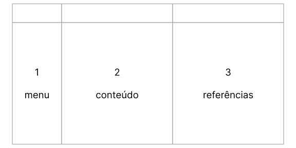

<head>
<link rel="preconnect" href="https://fonts.googleapis.com">
<link rel="preconnect" href="https://fonts.gstatic.com" crossorigin>
<link href="https://fonts.googleapis.com/css2?family=Zeyada&display=swap" rel="stylesheet">

</head>

# Bem-vindo à doutrina.org!

**Pré-release Alpha 10.23. Em desenvolvimento diário. Última atualização em 16 Out 2023.**

Inspirado em outras iniciativas de ensino digital, tais como [Kardecpedia](https://kardecpedia.com/pt){:target="ext"} e [Portal Luz Espírita](https://www.luzespirita.org.br/){:target="ext"}, decidimos criar uma alternativa que permitisse ao estudante a consulta direta de fontes complementares sem que seu foco se perdesse ao navegar em janelas externas. Para tal fim estamos desenvolvendo uma interface inédita em três colunas, dispostas assim:

1.  Menu, contendo links dos livros, o sumário do mesmo, e ferramentas do projeto (esconde em telas médias e pequenas)
2.  Conteúdo, dispondo da obra original em uma página única (sempre visível)
3.  Referências, possibilitando a consulta de enciclopédia, dicionário e atlas (com cortina anti-distração, esconde em telas pequenas)
4.  Adicionalmente, existe um quarto painel, escamoteavel, que possibilita grifos em amarelo e anotações (interface em Inglês, requere uma conta)

Ao invés do tradicional livro, exclusivamente em preto e branco, utilizaremos de emojis, painéis coloridos, e ilustrações para realçar as mensagens de origem espiritual, diferenciando-as de Kardec., exemplificado abaixo.

*   👻 Espíritos
*   👴🏻 Allan Kardec
*   ✝️ Bíblia

Nossas fases de desenvolvimento são:

*   extração (manual, copy & paste) do texto original em PDF para a formato MD. Status: LDE, LDM, ESE e CEU prontos. GEN em desenvolvimento ativo.
*   inclusão, sequencial (LDE, LDM, ESE, CEU e GEN) de links internos e externos (artigos, definições, mapas, vídeos, etc)

Para tal fim, use o menu, as setas de navegação ou os links abaixo.

*   👻  [O Livro dos Espíritos](./1lde.html )
*   ✒️  [O Livro dos Médiuns](./2ldm.html )
*   🕊️  [O Evangelho segundo o Espiritismo](./3ese.html )
*   🔥  [O Céu e o Inferno](./4ceu.html )
*   🌱  [A Gênese](./5gen.html )

Por fim, necessitamos de programadores front-end e full-stack. Caso queira contribuir com este projeto, entre em contato pelo Github.

Deus sempre abençoa!

Sergio
{:class="cursive"}