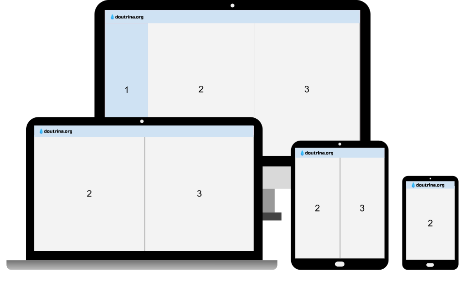
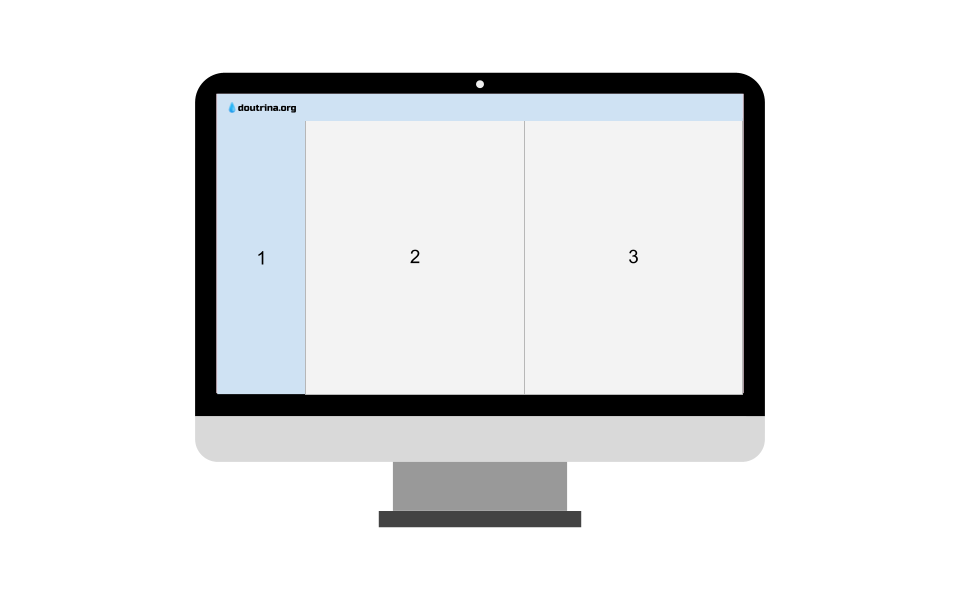
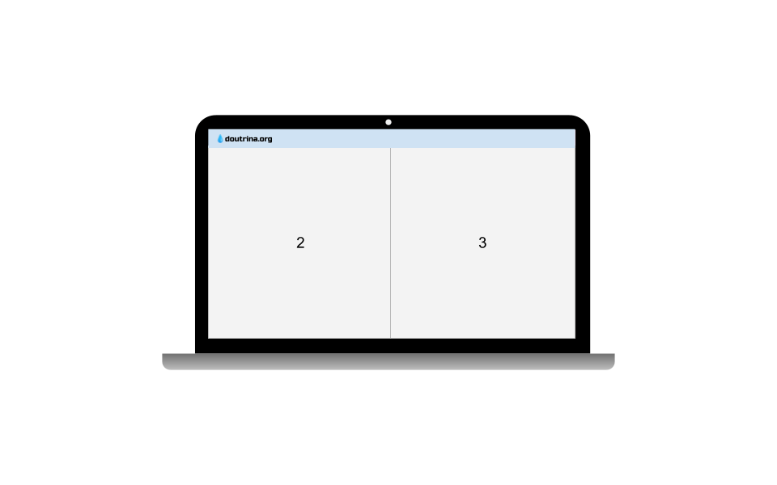
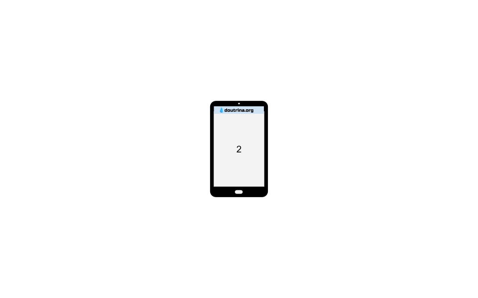
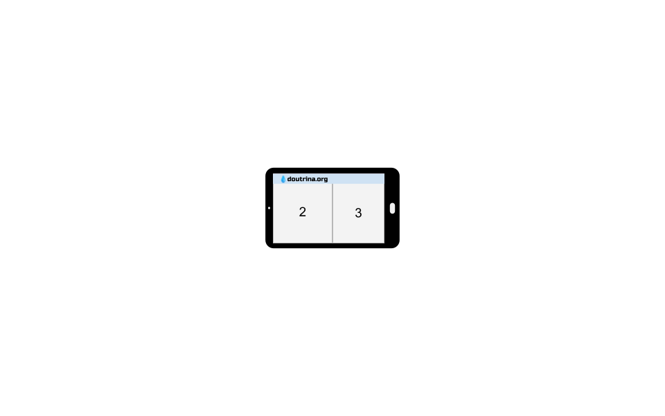

*[LDE]: O Livro dos Espíritos
*[LDM]: O Livro dos Médiuns
*[ESE]: O Evangelho segundo o Espiritismo
*[CEU]: O Céu e o Inferno
*[GEN]: A Gênese
*[PDF]: Portable Document Format
*[ARC]: Almeida Revista e Corrigida
*[MD]: Markdown file

# 🏠 Início

## Inspiração 

Com admiração em outras iniciativas de educação e comunicação digital, criamos esta alternativa que agrega ferramentas e fontes dispersas de modo a permitir aos usuários uma plataforma inédita de estudos integrados.

## Interface

Nosso <i>layout</i> é composto de três colunas, que são **seletivamente** mostradas de acordo com a largura do dispositivo em que é visualizada. Da esquerda para a direita, temos:

<table style="font-family: sans-serif; font-size: 14px; background-color: #eeeeee80">
  <tbody>
    <tr>
      <td>1. Menu</td>
      <td>2. Painel Principal</td>
      <td>3. Painel Complementar</td>
    </tr>
  </tbody>
</table>

 

  
1 / 6

  
  
Adaptação automática

  
2 / 6

  
  
Desktop

  
3 / 6

  
  
Notebook

    
4 / 6

    
    
Tablet

  

  
  

    
5 / 6

    
    
Mobile (de pé)

  

  
  

    
6 / 6

    
    
Mobile (deitado)

  

<a class="prev" onclick="plusSlides(-1)">❮</a>
<a class="next" onclick="plusSlides(1)">❯</a>

 

   
   
  
   
   
  

<!-- <iframe style="filter: none" src="https://docs.google.com/presentation/d/e/2PACX-1vRESbamVWKVF0_u4WuiG5c4dksBqoLB8F4JR7PYJbIKSZwUIgUilb5MtxrbbvdQpkNvtTEs_iQO0XMW/embed?start=true&loop=true&delayms=2000" frameborder="0" width="100%" height="40%%" allowfullscreen="true" mozallowfullscreen="true" webkitallowfullscreen="true"></iframe> -->

Consulte a página <kbd><a href="./2-info.html" style="text-decoration: none;">📋 Informações</a></kbd> para ficar a par dos padrões utilizados em nosso projeto.

## Modificações

Embora baseadas nas obras impressas, nossas versões foram modificadas para:

- realçar a origem mediúnica de mensagens
- realçar a concordância entre a Doutrina e a Bíblia
- facilitar o consumo digital (telas de tamanho variado)

Em suporte às nossas alterações, citamos aqui uma mensagem mediúnica, de vários Espíritos Superiores, extraída do Prefácio de O Livro dos Espíritos (grifo nosso).

<blockquote class="spirit" style="font-family: 'Roboto Serif', serif; padding: 10px 20px">
👻 … Mas todos os que tiverem em vista o grande princípio de Jesus se confundirão num só sentimento: o do amor do bem e <strong>se unirão por um laço fraterno</strong>, que prenderá o mundo inteiro. Estes <strong>deixarão de lado as miseráveis questões de palavras</strong>, para só se ocuparem com o que é essencial. <strong>E a Doutrina será sempre a mesma</strong> … </blockquote>

<!--
## Contato

Caso tenha alguma dúvida, entre em contato utilizando o botão do chat (canto inferior direito). 

<!--

-->

## Contato

Por fim, ficaríamos gratos com seus:

- comentários
- sugestões
- correções

Utilize a página <kbd><a href="./4-contact.html" style="text-decoration: none;">❤️ Contato</a></kbd> para tais fins.

---

Confiem em Deus e tenham um bom estudo!

Mai & Sergio
{:.cursive}

&nbsp;

