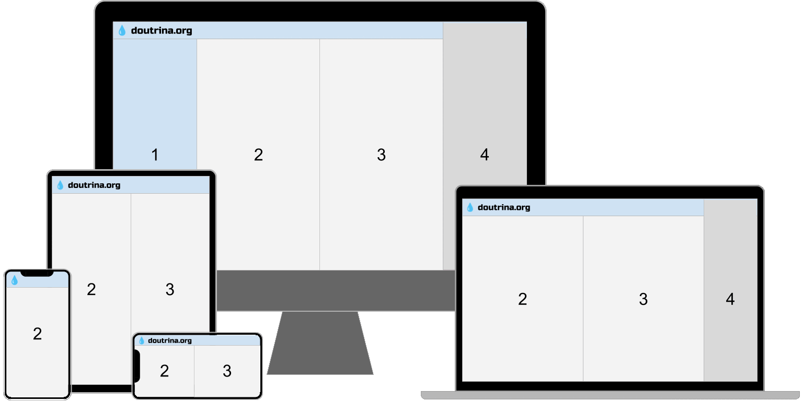
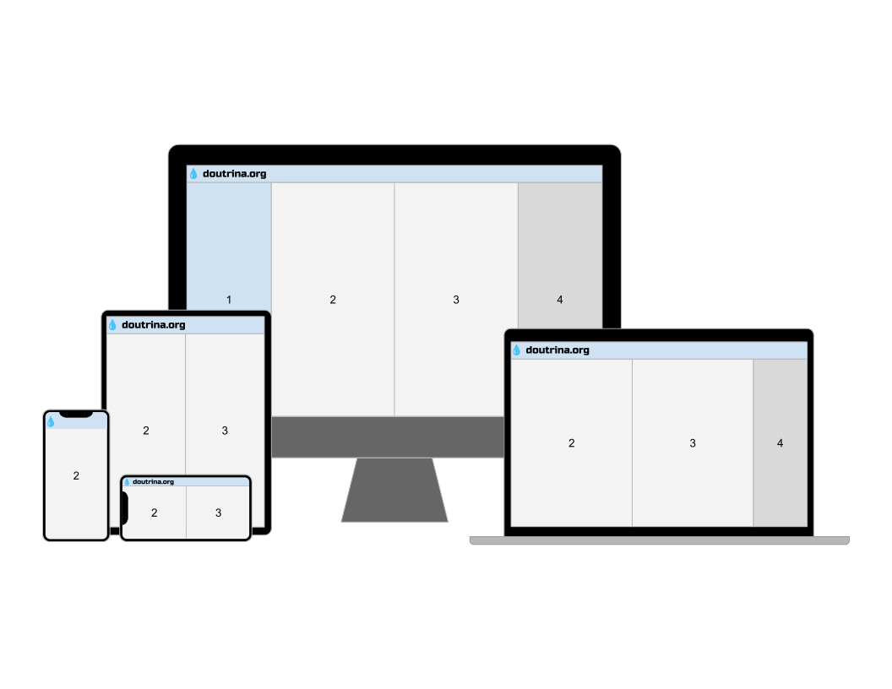
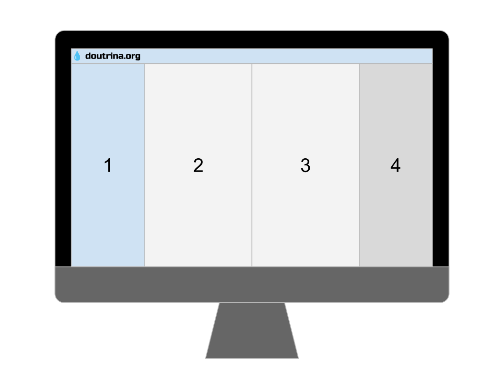

<head>
<link href="https://fonts.googleapis.com/css2?family=Zeyada&display=swap" rel="stylesheet">

</head>

*[LDE]: O Livro dos Espíritos
*[LDM]: O Livro dos Médiuns
*[ESE]: O Evangelho segundo o Espiritismo
*[CEU]: O Céu e o Inferno
*[GEN]: A Gênese
*[PDF]: Portable Document Format
*[ARC]: Almeida Revista e Corrigida
*[MD]: Markdown file

# 🏠 Início

## Inspiração 

Com imensa admiração por outras iniciativas de educação e comunicação digital, criei esta alternativa que agrega ferramentas e fontes dispersas, fornecendo aos usuários uma plataforma inédita de estudo, permitindo grifos, anotações e consulta de referências externas, sem se sair da janela original e escalável para qualquer tamanho de tela.

## Uso Indicado

Apesar de poder ser utilizada por leigos e de maneira individual, digo que o melhor aproveitamento desta plataforma seja alcançado por um estudo em grupo, liderado por pessoa versada na doutrina e TAMBÉM nas ferramentas aqui empregadas (incluindo Hypothes.is e sintaxe MD). Use a página <kbd><a href="./5-contact.html" style="text-decoration: none;">❤️ Contato</a></kbd> para marcar sessões de treinamento gratuitas.

## Interface

Nosso <i>layout</i> é composto de quatro abas ou colunas.

Estas são **seletivamente** mostradas de acordo com:

1. a largura do dispositivo em que é visualizada 😀
2. por comando do leitor 🫥

| Número |  Conteudo | Desktop | Laptop | Tablet | Celular (em pé) | Celular (deitado) |
|:------:|:---------:|:-------:|:------:|:------:|:---------------:|:-----------------:|
|    1   |    Menu   |    😀    |    🫥   |    🫥   |        🫥        |         🫥         |
|    2   |   Livro   |    😀    |    😀   |    😀   |        😀        |         😀         |
|    3   |  Artigos  |    😀    |    😀   |    😀   |        ❌        |         😀         |
|    4   | Anotações |    😀    |    😀   |    🫥   |        🫥        |         🫥         |

<!--
<table style="font-family: sans-serif; font-size: 14px; background-color: #eeeeee80">
  <tbody>
    <tr>
      <td>1. Menu</td>
      <td>2. Principal</td>
      <td>3. Complementar</td>
      <td>4. Anotações</td>
    </tr>
  </tbody>
</table>

 

  
1 / 6

  
  
Adaptação automática

  
2 / 6

  
  
Desktop

  
3 / 6

  
  
Laptop

    
4 / 6

    
    
Tablet

  

  
  

    
5 / 6

    
    
Celular (de pé)

  

  
  

    
6 / 6

    
    
Celular (deitado)

  

<a class="prev" onclick="plusSlides(-1)">❮</a>
<a class="next" onclick="plusSlides(1)">❯</a>

 

   
   
  
   
   
  

<!-- <iframe style="filter: none" src="https://docs.google.com/presentation/d/e/2PACX-1vRESbamVWKVF0_u4WuiG5c4dksBqoLB8F4JR7PYJbIKSZwUIgUilb5MtxrbbvdQpkNvtTEs_iQO0XMW/embed?start=true&loop=true&delayms=2000" frameborder="0" width="100%" height="40%%" allowfullscreen="true" mozallowfullscreen="true" webkitallowfullscreen="true"></iframe> -->

Consulte a página <kbd><a href="./2-manual.html" style="text-decoration: none;">📋 Manual</a></kbd> para ficar ciente dos padrões utilizados em nosso projeto.

## Modificações

Embora baseadas nas obras impressas, nossas versões foram modificadas para:

- Realçar a origem mediúnica de mensagens.
- Realçar a concordância entre a Doutrina e a Bíblia.
- Facilitar o consumo digital (telas de tamanho variado)

Em suporte às nossas alterações, citamos aqui uma mensagem mediúnica, de vários Espíritos Superiores, extraída do Prefácio de O Livro dos Espíritos.

<blockquote class="spirit" style="font-family: serif; padding: 10px 20px; font-size: 110%;">
👻 … Mas todos os que tiverem em vista o grande princípio de Jesus se confundirão num só sentimento: o do amor do bem e se unirão por um laço fraterno, que prenderá o mundo inteiro. Estes deixarão de lado as miseráveis questões de palavras, para só se ocuparem com o que é essencial. E a Doutrina será sempre a mesma … </blockquote>

---

Confiem em Deus e tenham um bom estudo!

Mai & Sergio
{:.cursive}

&nbsp;

&nbsp;

&nbsp;

